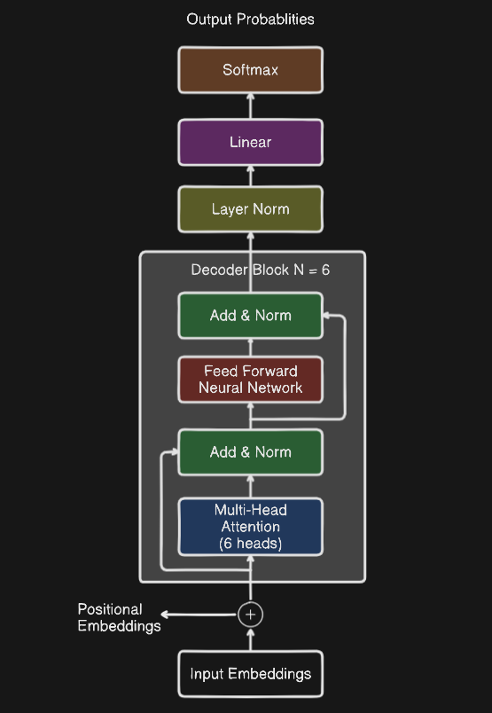
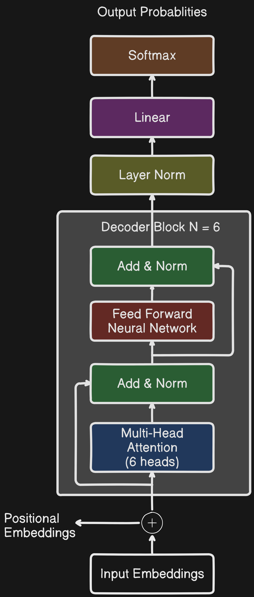
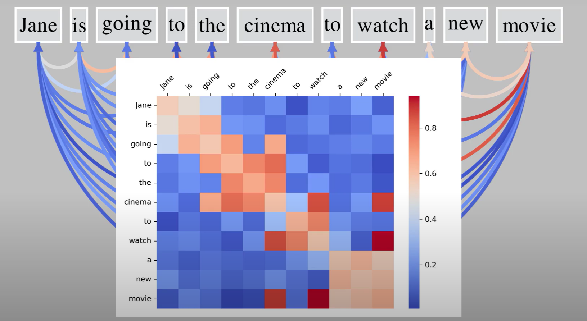

# Introduction

Implemented a Transformer-based Bigram model using PyTorch for next-character prediction with a
decoder-only architecture, optimized for autoregressive text generation, similar to models like GPT (Generative Pre-trained Transformer).

## System Design



<!--  -->

## Output OF Model

```text
No sleep;
Here well, sir, I for him left kill'd Ratclifford.
Is Margaret, to my king singerous soul
May nothing uncle again breather Warwick.

DUKE OF AUMERLE:
Yea bite so false reasoner be minister's card
fwifth this privile freely back.

WARWICK:
We'll not tell the disguised claudious wife;
And twelves bridges on t as dislough a highere
As obey'd as every Rutland,
In that this fool afters: but what this is the most?

DERBY:
Fall, in the news of absent, virtuous soul block,
My plicturely each t
```

## Self-Attention



## Gradient Descent


